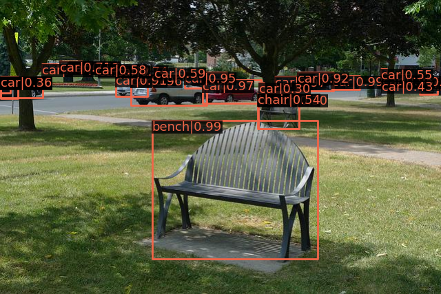

# MMDetection

MMDetection is a demonstration for using [MMDetection](https://github.com/open-mmlab/mmdetection) framework with DeepMux.

Function takes image data as input and returns an image with detected objects shown.



## Deploying

Download the model checkpoint from Git LFS:
```sh
git lfs pull
```


Run `deepmux upload` to upload function to the server.

Once the function finished processing you can test by calling it via HTTP API.

> Visit https://app.deepmux.com/api_key to get your API token.

```sh
curl -X POST \
     -H "X-Token: <YOUR API TOKEN>" \
     https://api.deepmux.com/v1/function/mmdet/run \
     --data-binary "@demo.jpg" \
     -o "result.jpg"
```
